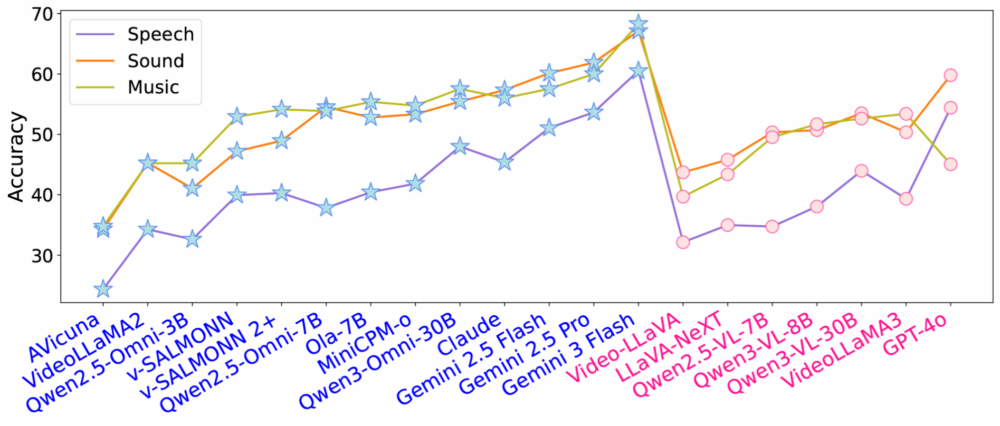
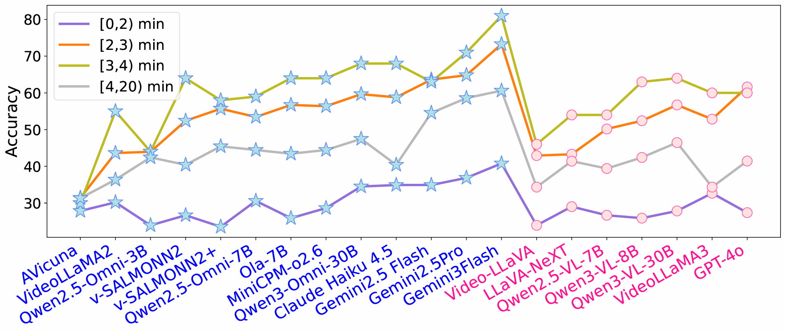
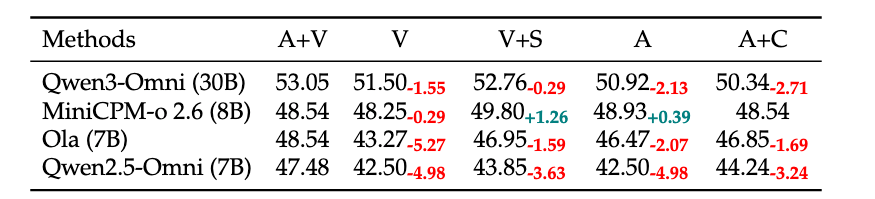
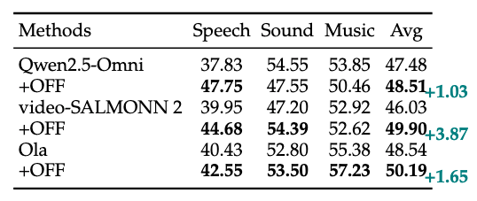
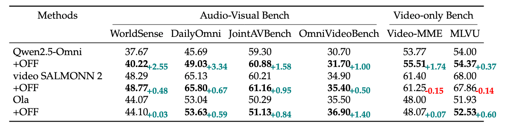

<div align="center">


# FutureOmni: Evaluating Future Forecasting from Omni-Modal Context for Multimodal LLMs

</div>

> **Predicting the future requires listening as well as seeing.**

Although Multimodal Large Language Models (MLLMs) demonstrate strong omni-modal perception, their ability to forecast future events from audio–visual cues remains largely unexplored, as existing benchmarks focus mainly on retrospective understanding.

**FutureOmni** is the first benchmark designed to evaluate **omni-modal future forecasting** from audio–visual environments. To succeed, models must perform cross-modal causal and temporal reasoning while effectively leveraging internal knowledge to predict future events.

---

## 🌟 Key Features

- **🎯 First Omni-Modal Forecasting Benchmark:** Dedicated exclusively to assessing whether models can predict future states based on audio-visual causal logic.
- **🏗️ Scalable Construction Pipeline:** Constructed via a robust LLM-assisted, human-in-the-loop pipeline ensuring high-quality causal pairs.
- **📊 Comprehensive & Original:** Contains **919** videos and **1,034** multiple-choice QA pairs across **8** primary domains. All videos are collected to ensure **zero contamination** (100% Original Video Rate).
- **🧩 Challenging Evaluation:** Evaluations on **13 omni-modal** and **7 video-only** models reveal that current systems struggle significantly, particularly in speech-heavy scenarios.
- **🚀 OFF Training Strategy:** We propose the **Omni-Modal Future Forecasting (OFF)** strategy and provide a **7K-sample instruction-tuning dataset**, which enhances both future forecasting and general perception capabilities.

---

## 📊 Leaderboard


*Snapshot of Zero-shot performance (Accuracy %). See the paper for full results.*

| Model | Size | Speech | Sound | Music | **Avg** |
| :--- | :---: | :---: | :---: | :---: | :---: |
| **Gemini 3 Flash** 🏆 | - | 60.52 | 67.13 | 68.31 | **64.80** |
| **Gemini 2.5 Pro** | - | 48.23 | 61.89 | 63.38 | **56.77** |
| **Qwen3-Omni** | 30B | 47.99 | 55.44 | 57.54 | **53.05** |
| **Claude Haiku 4.5** | - | 55.56 | 64.00 | 43.82 | **51.52** |
| **Video-SALMONN 2** | 7B | 40.28 | 48.95 | 54.15 | **47.00** |
| **Qwen2.5-Omni** | 7B | 37.83 | 54.55 | 53.85 | **47.48** |
| *GPT-4o* | - | 54.41 | 59.80 | 45.05 | 52.29 |

---
## 🌰 Data Example
<div align="center">
    
</div>

---
## 📂 Data Format

Each entry in the annotation file is formatted as follows:

```json
{
    "id": 0,
    "question": "Given the premise event: 'The man repeatedly demonstrates a new rhythm pattern, playing the guitar on \"One, two, three\" and explicitly pausing on the \"Four\" count while vocally counting', which event is its most direct conclusion?",
    "options": [
        "A. He continues to demonstrate the same pattern for several more minutes",
        "B. He stops playing the guitar and says 'Okay' and 'I hope everyone understood.'",
        "C. He introduces a completely different, more complex strumming pattern",
        "D. He puts down the guitar and begins to explain music theory concepts",
        "E. He asks the viewers to play along with him and checks their progress"
    ],
    "answer": "B",
    "original_video": "uu8c_EH8VPE.mp4",
    "split_point": 227,
    "video_domain": "education",
    "audio_type": "Sound",
    "forecasting_pattern": "Routine Sequences"
}
```

---
## 🧪 Experiments
We conduct extensive evaluations on **13 omni-modal** and **7 video-only** models.

### Overall Performance
<div align="center">
    
    <p>Overall Performance on Categories</p>
</div>

### 🔍 Fine-grained Results
<div align="center">
    
    <p>Fine-grained Results on Audio Type</p>
</div>
<div align="center">
    
    <p>Fine-grained Results on Video Duration</p>
</div>

### 🧠 In-depth Analysis
<div align="center">
    
    <p>Modality Ablation Results</p>
</div>

---


## 🚀 Omni-Modal Future Forecasting (OFF) Strategy

To mitigate current limitations, we curate a **7K-sample instruction-tuning dataset**.

**Key Finding:** Evaluations on **FutureOmni** and popular audio-visual (e.g., WorldSense, DailyOmni) and video-only (e.g., Video-MME) benchmarks demonstrate that the **OFF** strategy significantly enhances both future forecasting and general perception.

<div align="center">
    
    <p>Fine-grained Audio Performance</p>
</div>

<div align="center">
    
    <p>Fine-grained Video Category Performance</p>
</div>

<div align="center">
    
    <p>General Capability</p>
</div>

## 🛠️ Quick Start


###  Evaluation
We offer two implentions. One is using DDP. The example code is in `eval/infer_ddp.py`. Another is using vLLM. The example code is in  `eval/infer_vllm.py`. We strongly recommand preprocess the input feature for speeding up. The feature extraction code is in `feature/extract.py`.


